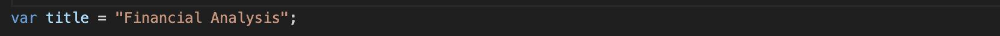

# Console Finances Challenge

## Description

The task is to create code for analyzing the financial records of a company, I guess should have functions to do it more efficiently but I did not want to investigate to do it that way because I prefer to work with the skills that I have learned during this week.

  In this challenge, I have been investigating by myself a few new things to complete it. Also, I had to ask a friend who is an accountant how they do that calculation to try to understand how to start to code.
  On the other hand, when I was almost finished I was unable to make the code work and I asked a friend for help, he revised my code and suggested I should use and learn about `(...)`, to be honest, without his help I think I am never would found where the problem was. That is why I want to start the things that I have learned with... 
  - The spread syntax`(...)` Although I am not very clear about how it works, I can understand that lets me fill a space in the var where a value was expected to be.
  - I learned about `.push()` because let me add a new element to the array called changes when I was calculating the changes in profit and loss. I need to do that array will help me to calculate the average.
  - I have learned, and probably it was the easiest, the methods `Math.max` and `Math.mix` which return the maximum/minimum figures respectively and those were crucial to have the results for the greatest increase and decrease.
  - `indexOf()` shows me where to find the figure that I need in the array.
  - I have learned that I can use `toFixed()` to control how many decimals I want to show in a figure.
  - I have learned how to add images to the `README` file.
  - I have learned how to use Template Literal and I think is more easy to use than String Concatenation.

## Logic

  - Heading.
     - I have put the title of the exercise into a var called `title`.
        
  - Calculating the number of elements in the array.
     - I start by counting the total number of months included in the dataset. This is done by using the `length` property of the `finances` array, which gives us the number of elements (or months) in the array.
        
  - Calculating the gross amount.
     - To calculate the gross total amount of Profit/Losses over the entire period, I use a variable called `totalAmount` equal to 0. Then, I loop through each entry in the `finances` array and add the profit/loss value to the `totalAmount` variable. This gives us the total profit or loss over the entire period.
       
  - Calculating the changes in profit/losses.
    - I calculate the changes in Profit/Loss by subtracting the profit/loss value of the current month from the profit/loss value of the previous month. These differences are stored in an array called `changes`. This helps me understand how the profit or loss fluctuates from one month to the next.
      
  - Calculate the average of the changes in profit/losses.
    - To find the average change in profit/loss, I am adding all the changes in the `changes` array and dividing the total by the total number of months minus 1. This gives me an idea of the fluctuations in the financial data over the entire period.
      
  - Calculating the greatest increase in profits/losses.
    - I identify the greatest increase and decrease in Profit/Losses by finding the maximum and minimum values in the `changes` array. This helps me to mark with precision the months with the most significant positive and negative changes in profits.
       
  - Calculating the greatest decrease in profit/losses.
    - Basically, I have used the same logic as before but inverse.
       
  - Output.
    - This is how I resolved to print the results on the console, I decided to use template literals because I think are more easy and intuitive to use.
    
      

## License
MIT License Copyright (c) 2023 Luis Marquez-Garrido

